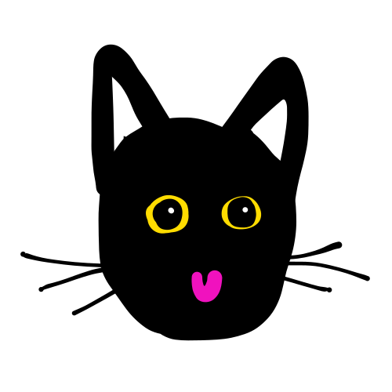

<h1 align="center">
<a href="wushibrush.netlify.app" target="_blank">
Wushibrush
</a>
</h1>

Super simple painting app.

* Brush sizes
* Colors
* Eraser
* Rectangles/Circles/Lines
* Eyedropper
* Undo/redo
* Save as SVG

## Keyboard Shortcuts
| Action | Shortcuts |
| -------- | ------ |
| Brush | <kbd>b</kbd> |
| Eraser | <kbd>e</kbd> |
| Rectangle | <kbd>r</kbd> |
| Circle | <kbd>c</kbd> |
| Line | <kbd>l</kbd> |
| Eyedropper | <kbd>i</kbd> |
| Undo | <kbd>ctrl+z</kbd> / <kbd>cmd+z</kbd> |
| Redo | <kbd>ctrl+shift+z</kbd> / <kbd>cmd+shift+z</kbd> |
| Download | <kbd>ctrl+s</kbd> / <kbd>cmd+s</kbd> |
| Brush Size 1 | <kbd>1</kbd> |
| Brush Size 2 | <kbd>2</kbd> |
| Brush Size 3 | <kbd>3</kbd> |
| Brush Size 4 | <kbd>4</kbd> |
| Brush Size 5 | <kbd>5</kbd> |
